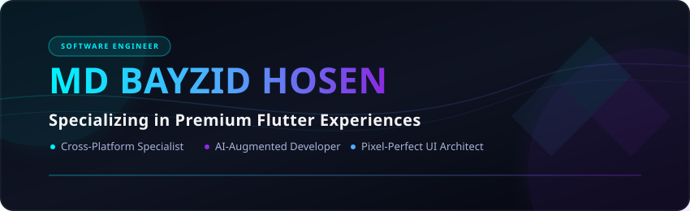

<!-- ═══════════════════════════════════════════════════════════════════════════ -->
<!-- 🎨 HEADER — Custom Premium Designed Banner                               -->
<!-- ═══════════════════════════════════════════════════════════════════════════ -->

<p align="center">
  
</p>

<!-- ═══════════════════════════════════════════════════════════════════════════ -->
<!-- ⌨️ ANIMATED TYPING                                                        -->
<!-- ═══════════════════════════════════════════════════════════════════════════ -->

<p align="center">
  <a href="https://git.io/typing-svg">
    
  </a>
</p>

<!-- ═══════════════════════════════════════════════════════════════════════════ -->
<!-- 🔗 SOCIAL & PROFESSIONAL LINKS                                            -->
<!-- ═══════════════════════════════════════════════════════════════════════════ -->

<p align="center">
  <a href="https://mdbayzid-portfolio.web.app/" target="_blank">
    
  </a>&nbsp;
  <a href="https://linkedin.com/in/mdbayzid131" target="_blank">
    
  </a>&nbsp;
  <a href="mailto:mdbayazid131@gmail.com">
    
  </a>&nbsp;
  <a href="https://github.com/mdbayzid131" target="_blank">
    
  </a>&nbsp;
  <a href="https://facebook.com/mdbayzid131" target="_blank">
    
  </a>
</p>

<p align="center">
  
  &nbsp;&nbsp;
  
  &nbsp;&nbsp;
  
</p>

<!-- ═══════════════════════════════════════════════════════════════════════════ -->
<!-- 📌 QUICK NAVIGATION                                                       -->
<!-- ═══════════════════════════════════════════════════════════════════════════ -->

<p align="center">
  <b>
    <a href="#-about-me">👤 About Me</a> &nbsp;•&nbsp; 
    <a href="#-what-im-building-now">🎯 Current Focus</a> &nbsp;•&nbsp; 
    <a href="#-featured-projects">🚀 Projects</a> &nbsp;•&nbsp; 
    <a href="#-technical-arsenal">🛠️ Tech Stack</a> &nbsp;•&nbsp; 
    <a href="#-github-analytics">📊 Analytics</a> &nbsp;•&nbsp; 
    <a href="#-lets-connect">📫 Connect</a>
  </b>
</p>


<!-- ═══════════════════════════════════════════════════════════════════════════ -->
<!-- 👤 ABOUT ME                                                               -->
<!-- ═══════════════════════════════════════════════════════════════════════════ -->

##  About Me

```yaml
Name: MD Bayzid Hosen
Designation: Software Engineer & Flutter Developer
Education: B.Sc. in Computer Science & Engineering
Location: Dhaka, Bangladesh
Focus: Flutter, GetX, Firebase, REST API Integration, UI/UX Design, AI-Augmented Development
```


-  **Software Engineer** specializing in **Flutter** with production-grade mobile applications
-  Strong foundation in **UI/UX Design** — pixel-perfect, user-centric interfaces
-  Expert in **GetX State Management**, **REST API Integration**, and **Firebase**
-  Pioneering **AI-Augmented Development** — leveraging Gemini, GPT, and Antigravity AI to ship 3x faster
-  Delivered **5+ mobile applications** from concept to deployment
-  Currently expanding into **Backend Architecture** (Node.js, Express, MongoDB)
-  **2025 Goal:** Become a proficient **Full-Stack Mobile Engineer**
-  **Fun Fact:** I debug with coffee ☕ and ship features with determination 

<br clear="right">


<!-- ═══════════════════════════════════════════════════════════════════════════ -->
<!-- 🎯 CURRENT FOCUS                                                          -->
<!-- ═══════════════════════════════════════════════════════════════════════════ -->

## 🎯 What I'm Building Now

<table>
  <tr>
    <td width="50%">
      <h3 align="center">🔭 Currently Working On</h3>
      <p>
        • Production-grade Flutter apps with clean architecture<br>
        • AI-integrated mobile experiences<br>
        • Cross-platform solutions with shared business logic
      </p>
    </td>
    <td width="50%">
      <h3 align="center">📚 Currently Learning</h3>
      <p>
        • Backend development with Node.js & Express<br>
        • Database design with MongoDB & PostgreSQL<br>
        • DevOps fundamentals & CI/CD pipelines
      </p>
    </td>
  </tr>
  <tr>
    <td width="50%">
      <h3 align="center">🤝 Open to Collaborate On</h3>
      <p>
        • Open-source Flutter packages & plugins<br>
        • AI-powered mobile applications<br>
        • Community-driven developer tools
      </p>
    </td>
    <td width="50%">
      <h3 align="center">💡 Ask Me About</h3>
      <p>
        • Flutter architecture & best practices<br>
        • GetX state management patterns<br>
        • AI-augmented development workflows
      </p>
    </td>
  </tr>
</table>


<!-- ═══════════════════════════════════════════════════════════════════════════ -->
<!-- 🚀 FEATURED PROJECTS                                                      -->
<!-- ═══════════════════════════════════════════════════════════════════════════ -->

## 🚀 Featured Projects

> _"Code is poetry — and these are my best verses."_

<table>
  <tr>
    <td width="50%">
      <h3 align="center">📱 WhichWin — Decision Maker App</h3>
      <p align="center">
        <a href="https://github.com/mdbayzid131/which_win" target="_blank">
          
        </a>
      </p>
      <p>
        A beautifully designed Flutter app that helps users make decisions effortlessly. Features smooth animations, intuitive UI, and GetX-powered state management.
      </p>
      <p align="center">
        
        
        
      </p>
    </td>
    <td width="50%">
      <h3 align="center">🌐 Personal Portfolio Website</h3>
      <p align="center">
        <a href="https://mdbayzid-portfolio.web.app/" target="_blank">
          
        </a>
      </p>
      <p>
        A modern, responsive portfolio website deployed on Firebase Hosting. Showcases my work, skills, and professional journey with a sleek, interactive design.
      </p>
      <p align="center">
        
        
        
      </p>
    </td>
  </tr>
  <tr>
    <td width="50%" colspan="2">
      <h3 align="center">🔮 More Projects Coming Soon...</h3>
      <p align="center">
        I'm constantly building and shipping. Star ⭐ my repos to stay updated on my latest work!
      </p>
      <p align="center">
        <a href="https://github.com/mdbayzid131?tab=repositories" target="_blank">
          
        </a>
      </p>
    </td>
  </tr>
</table>


<!-- ═══════════════════════════════════════════════════════════════════════════ -->
<!-- 🛠️ TECHNICAL ARSENAL                                                      -->
<!-- ═══════════════════════════════════════════════════════════════════════════ -->

## 🛠️ Technical Arsenal

<table>
  <tr>
    <td valign="top" width="50%">
      <h3 align="center">🚀 Mobile Engineering</h3>
      <br>
      <p align="center">
        <a href="https://skillicons.dev">
          
        </a>
      </p>
      <p align="center">
        
        
        
        
        
      </p>
    </td>
    <td valign="top" width="50%">
      <h3 align="center">⚡ Backend & Integrations</h3>
      <br>
      <p align="center">
        <a href="https://skillicons.dev">
          
        </a>
      </p>
      <p align="center">
        
        
        
        
      </p>
    </td>
  </tr>
  <tr>
    <td valign="top" width="50%">
      <h3 align="center">🧰 Developer Toolkit</h3>
      <br>
      <p align="center">
        <a href="https://skillicons.dev">
          
        </a>
      </p>
    </td>
    <td valign="top" width="50%">
      <h3 align="center">🤖 AI Workflow</h3>
      <br>
      <p align="center">
        
        
        
        
        
      </p>
    </td>
  </tr>
</table>


<!-- ═══════════════════════════════════════════════════════════════════════════ -->
<!-- 💭 DEVELOPMENT PHILOSOPHY                                                 -->
<!-- ═══════════════════════════════════════════════════════════════════════════ -->

## 💭 Development Philosophy

<table>
  <tr>
    <td align="center" width="25%">
      <br>
      <b>Clean Code</b><br>
      <sub>Readable, maintainable, and well-documented — every single time.</sub>
    </td>
    <td align="center" width="25%">
      <br>
      <b>User-First</b><br>
      <sub>Every pixel serves a purpose. Design with empathy, build with precision.</sub>
    </td>
    <td align="center" width="25%">
      <br>
      <b>AI-Augmented</b><br>
      <sub>Leverage intelligent tools to amplify human creativity, not replace it.</sub>
    </td>
    <td align="center" width="25%">
      <br>
      <b>Never Stop</b><br>
      <sub>Continuous learning is the only true competitive advantage.</sub>
    </td>
  </tr>
</table>


<!-- ═══════════════════════════════════════════════════════════════════════════ -->
<!-- 📊 GITHUB ANALYTICS                                                       -->
<!-- ═══════════════════════════════════════════════════════════════════════════ -->

## 📊 GitHub Analytics

<p align="center">
  <a href="https://github.com/mdbayzid131">
    
  </a>
  <a href="https://github.com/mdbayzid131">
    
  </a>
</p>

<p align="center">
  <a href="https://github.com/mdbayzid131">
    
  </a>
</p>

<p align="center">
  <a href="https://github.com/mdbayzid131">
    
  </a>
</p>


<!-- ═══════════════════════════════════════════════════════════════════════════ -->
<!-- 📈 CONTRIBUTION OVERVIEW                                                  -->
<!-- ═══════════════════════════════════════════════════════════════════════════ -->

## 📈 Contribution Overview

<p align="center">
  <a href="https://github.com/mdbayzid131">
    
  </a>
</p>

<p align="center">
  <a href="https://github.com/mdbayzid131">
    
  </a>
  <a href="https://github.com/mdbayzid131">
    
  </a>
  <a href="https://github.com/mdbayzid131">
    
  </a>
</p>


<!-- ═══════════════════════════════════════════════════════════════════════════ -->
<!-- 📫 CONTACT / CONNECT                                                      -->
<!-- ═══════════════════════════════════════════════════════════════════════════ -->

## 📫 Let's Connect

<p align="center">
  <i>I'm always open to interesting conversations, collaboration opportunities, and innovative project ideas.</i>
</p>

<p align="center">
  <a href="https://mdbayzid-portfolio.web.app/" target="_blank">
    
  </a>&nbsp;
  <a href="https://linkedin.com/in/mdbayzid131" target="_blank">
    
  </a>&nbsp;
  <a href="mailto:mdbayazid131@gmail.com">
    
  </a>&nbsp;
  <a href="https://facebook.com/mdbayzid131" target="_blank">
    
  </a>
</p>

<br>

<!-- ═══════════════════════════════════════════════════════════════════════════ -->
<!-- 🎬 FOOTER                                                                 -->
<!-- ═══════════════════════════════════════════════════════════════════════════ -->

<div align="center">

  

  <br><br>

  <b>🤝 If you find my work valuable, consider giving a ⭐</b><br>
  <sub>It motivates me to keep building and sharing with the community.</sub>

  <br><br>

  

</div>
